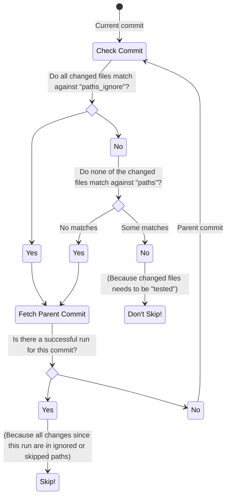

# Skip Duplicate Actions

`skip-duplicate-actions` provides the following features to optimize GitHub Actions:

- [Skip duplicate workflow runs](#skip-duplicate-workflow-runs) after merges, pull requests or similar.
- [Skip concurrent or parallel workflow runs](#skip-concurrent-workflow-runs) for things that you do not want to run twice.
- [Skip ignored paths](#skip-ignored-paths) to speedup documentation-changes or similar.
- [Skip if paths not changed](#skip-if-paths-not-changed) for something like directory-specific tests.
- [Cancel outdated workflow runs](#cancel-outdated-workflow-runs) after branch-pushes.

All of those features help to save time and costs; especially for long-running workflows.
You can choose any subset of those features.

## Skip duplicate workflow runs

If you work with feature branches, then you might see lots of _duplicate workflow runs_.
For example, duplicate workflow runs can happen if a workflow run is performed on a feature branch, but then the workflow run is repeated right after merging the feature branch.
`skip-duplicate-actions` allows to prevent such runs.

- **Full traceability:** After clean merges, you will see a message like `Skip execution because the exact same files have been successfully checked in <previous_run_URL>`.
- **Fully configurable:** By default, manual triggers and cron will never be skipped.
- **Flexible Git usage:** `skip-duplicate-actions` does not care whether you use fast-forward-merges, rebase-merges or squash-merges.
  However, if a merge yields a result that is different from the source branch, then the resulting workflow run will _not_ be skipped.
  This is commonly the case if you merge "outdated branches".

## Skip concurrent workflow runs

Sometimes, there are workflows that you do not want to run twice at the same time even if they are triggered twice.
Therefore, `skip-duplicate-actions` provides the following options to skip a workflow run if the same workflow is already running:

- **Always skip:** This is useful if you have a workflow that you never want to run twice at the same time.
- **Only skip same content:** For example, this can be useful if a workflow has both a `push` and a `pull_request` trigger, or if you push a tag right after pushing a commit.
  (_Deprecated_, use `same_content_newer` instead)
- **Only skip newer runs with the same content:** If the same workflow is running on the exact same content, skip newer runs of it. `same_content_newer` ensures that at least one of those workflows will run, while `same_content` may skip all of them.
- **Only skip outdated runs:** For example, this can be useful for skip-checks that are not at the beginning of a job.
- **Never skip:** This disables the concurrent skipping functionality, but still lets you use all other options like duplicate skipping.

## Skip ignored paths

In many projects, it is unnecessary to run all tests for documentation-only-changes.
Therefore, GitHub provides a [paths-ignore](https://docs.github.com/en/actions/using-workflows/workflow-syntax-for-github-actions#onpushpull_requestpull_request_targetpathspaths-ignore) feature out of the box.
However, GitHub's `paths-ignore` has some limitations:

- GitHub's `paths-ignore` fails to look at previous commits. This means that the outcome depends on how often you push changes.
- Consequently, GitHub's `paths-ignore` does not work for [required checks](https://docs.github.com/en/github/administering-a-repository/about-required-status-checks).
  If you path-ignore a required check, then pull requests will block forever without being mergeable.

To overcome those limitations, `skip-duplicate-actions` provides a more flexible `paths_ignore`-feature with an efficient backtracking-algorithm.
Instead of stupidly looking at the current commit, `paths_ignore` will look for successful checks in your commit-history.

You can use the [`paths_filter`](#paths_filter) option if you need to define multiple `paths_ignore` patterns in a single workflow.

## Skip if paths not changed

In some projects, there are tasks that should be only executed if specific sub-directories were changed.
Therefore, GitHub provides a [paths](https://docs.github.com/en/actions/reference/workflow-syntax-for-github-actions#onpushpull_requestpaths) feature out of the box.
However, GitHub's `paths` has some limitations:

- GitHub's `paths` cannot skip individual steps in a workflow.
- GitHub's `paths` does not work with required checks that you really want to pass successfully.

To overcome those limitations, `skip-duplicate-actions` provides a more sophisticated `paths`-feature.
Instead of blindly skipping checks, the backtracking-algorithm will only skip something if it can find a suitable check in your commit-history.

You can use the [`paths_filter`](#paths_filter) option if you need to define multiple `paths` patterns in a single workflow.

## Cancel outdated workflow runs

Typically, workflows should only run for the most recent commit.
Therefore, when you push changes to a branch, `skip-duplicate-actions` can be configured to cancel any previous workflow runs that run against outdated commits.

- **Full traceability:** If a workflow run is cancelled, then you will see a message like `Cancelled <previous_run_URL>`.
- **Guaranteed execution:** The cancellation-algorithm guarantees that a complete check-set will finish no matter what.

## Inputs

### `paths_ignore`

A JSON-array with ignored path patterns.
See [cheat sheet](https://docs.github.com/en/actions/reference/workflow-syntax-for-github-actions#filter-pattern-cheat-sheet) for path-pattern examples.
See [micromatch](https://github.com/micromatch/micromatch) for details about supported path-patterns.

**Example:** `'["**/README.md", "**/docs/**"]'`

**Default:** `'[]'`

### `paths`

A JSON-array with path patterns.
If this is non-empty, then `skip-duplicate-actions` will try to skip commits that did not change any of those paths.
It uses the same syntax as [`paths_ignore`](#paths_ignore).

**Example:** `'["platform-specific/**"]'`

**Default:** `'[]'`

### `paths_filter`

A YAML-string with named [`paths_ignore`](#paths_ignore) / [`paths`](#paths) patterns.

**Example:**

```yaml
frontend:
  paths_ignore:
    - 'frontend/docs/**'
  paths:
    - 'frontend/**'
backend:
  paths:
    - 'backend/**'
  ### Here you can optionally control/limit backtracking
  # Boolean or number (default: true)
  # 'false' means disable backtracking completely
  # '5' means to stop after having traced back 5 commits
  backtracking: 5
```

Useful if you have multiple jobs in one workflow and want to skip them based on different [`paths_ignore`](#paths_ignore) / [`paths`](#paths) patterns.
See the corresponding [`paths_result`](#paths_result) output and [example configuration](#example-3-skip-using-paths_filter).

### `cancel_others`

If true, then workflow runs from outdated commits will be cancelled.

**Default:** `'false'`

### `skip_after_successful_duplicate`

If true, skip if an already finished duplicate run can be found.

**Default:** `'true'`

### `do_not_skip`

A JSON-array with triggers that should never be skipped.

Possible values are `pull_request`, `push`, `workflow_dispatch`, `schedule`, `release`.

**Default:** `'["workflow_dispatch", "schedule"]'`

### `concurrent_skipping`

Skip a workflow run if the same workflow is already running.

One of `never`, `same_content`, `same_content_newer`, `outdated_runs`, `always`.

**Default:** `'never'`

## Outputs

### `should_skip`

Returns `'true'` if the current run should be skipped according to your configured rules. This should be evaluated for either individual steps or entire jobs.

### `reason`

The reason why the current run is considered skippable or unskippable. Corresponds approximately to the input options.

**Example:** `skip_after_successful_duplicate`

### `skipped_by`

Returns information about the workflow run which caused the current run to be skipped.

**Example:**

```json
{
  "id": 1709469369,
  "runNumber": 737,
  "event": "pull_request",
  "treeHash": "e3434bb7aeb3047d7df948f09419ac96cf03d73e",
  "commitHash": "4a0432e823468ecff81a978165cb35586544c795",
  "status": "completed",
  "conclusion": "success",
  "htmlUrl": "https://github.com/fkirc/skip-duplicate-actions/actions/runs/1709469369",
  "branch": "master",
  "repo": "fkirc/skip-duplicate-actions",
  "workflowId": 2640563,
  "createdAt": "2022-01-17T18:56:06Z"
}
```

- Returns information only when current run is considered skippable, otherwise an empty object (`{}`) is returned.

### `paths_result`

Returns information for each configured filter in `paths_filter`.

**Example:**

```jsonc
{
  "frontend": {
    "should_skip": true,
    "backtrack_count": 1,
    "skipped_by": {
      // Information about the workflow run
    },
  "backend": {
    "should_skip": false,
    "backtrack_count": 1,
    "matched_files": ["backend/file.txt"]
  },
  "global": {
    "should_skip": false,
    "backtrack_count": 0
  }
}
```

- The `global` key corresponds to the "global" [`paths_ignore`](#paths_ignore) and [`paths`](#paths) options.
- A list of matched files is returned in `matched_files`, if there are any.
- The `skipped_by` return value behaves the same as the "global" [`skipped_by`](#skipped_by) output.
- The `backtrack_count` shows how many commits where traced back (skipped) until an appropriate commit has been found.
- If `skip-duplicate-actions` terminates before the paths checks are performed (for example, when a successful duplicate run has been found) an empty object is returned (`{}`).

### `changed_files`

A two-dimensional array, with a list of changed files for each commit that has been traced back.

**Example:** `[["some/example/file.txt", "another/example/file.txt"], ["frontend/file.txt"]]`

- Having a two-dimensional list makes processing flexible. For example, one can flatten (and uniquify) the list to get changed files from all commits which were traced back. Or one can use `changed_files[0]` to get changed files from the latest commit. One might also use the output of `backtrack_count` from [`paths_result`](#paths_result) to process the list of changed files.
- Returns information only if one of the options [`paths_ignore`](#paths_ignore), [`paths`](#paths), [`paths_filter`](#paths_filter) is set.
- If `skip-duplicate-actions` terminates before the paths checks are performed (for example, when a successful duplicate run has been found) an empty array (`[]`) is returned.

## Usage examples

You can use `skip-duplicate-actions` to either skip individual steps or entire jobs.
To minimize changes to existing jobs, it is often easier to skip entire jobs.

> **Note**
>
> - You may need to use [`fromJSON`](https://docs.github.com/en/actions/learn-github-actions/expressions#fromjson) to access properties of object outputs. For example, for `skipped_by.id`, you can use the expression: `${{ fromJSON(steps.skip_check.outputs.skipped_by).id }}`.
> - For GitHub repositories where [default permissions](https://docs.github.com/en/repositories/managing-your-repositorys-settings-and-features/enabling-features-for-your-repository/managing-github-actions-settings-for-a-repository#setting-the-permissions-of-the-github_token-for-your-repository) for `GITHUB_TOKEN` has been set to "permissive (read-only)", the following lines must be included in the workflow (see [permissions syntax](https://docs.github.com/en/actions/using-workflows/workflow-syntax-for-github-actions#permissions)):
>   ```yaml
>   # Minimum permissions required by skip-duplicate-actions
>   permissions:
>     actions: write
>     contents: read
>   ```

### Example 1: Skip entire jobs

To skip entire jobs, you should add a `pre_job` that acts as a pre-condition for your `main_job`.
Although this example looks like a lot of code, there are only two additional lines in your project-specific `main_job` (the `needs`-clause and the `if`-clause):

```yml
jobs:
  pre_job:
    # continue-on-error: true # Uncomment once integration is finished
    runs-on: ubuntu-latest
    # Map a step output to a job output
    outputs:
      should_skip: ${{ steps.skip_check.outputs.should_skip }}
    steps:
      - id: skip_check
        uses: fkirc/skip-duplicate-actions@v5
        with:
          # All of these options are optional, so you can remove them if you are happy with the defaults
          concurrent_skipping: 'never'
          skip_after_successful_duplicate: 'true'
          paths_ignore: '["**/README.md", "**/docs/**"]'
          do_not_skip: '["pull_request", "workflow_dispatch", "schedule"]'

  main_job:
    needs: pre_job
    if: needs.pre_job.outputs.should_skip != 'true'
    runs-on: ubuntu-latest
    steps:
      - run: echo "Running slow tests..." && sleep 30
```

### Example 2: Skip individual steps

The following example demonstrates how to skip an individual step with an `if`-clause and an `id`.
In this example, the step will be skipped if no files in `src/` or `dist/` were changed:

```yml
jobs:
  skip_individual_steps_job:
    runs-on: ubuntu-latest
    steps:
      - id: skip_check
        uses: fkirc/skip-duplicate-actions@v5
        with:
          cancel_others: 'false'
          paths: '["src/**", "dist/**"]'
      - if: steps.skip_check.outputs.should_skip != 'true'
        run: |
          echo "Run only if src/ or dist/ changed..." && sleep 30
          echo "Do other stuff..."
```

### Example 3: Skip using `paths_filter`

The `paths_filter` option can be used if you have multiple jobs in a workflow and want to skip them based on different [`paths_ignore`](#paths_ignore) / [`paths`](#paths) patterns. When defining such filters, the action returns corresponding information in the [`paths_result`](#paths_result) output.
For example in a monorepo, you might want to run jobs related to the "frontend" only if some files in the corresponding "frontend/" folder have changed and the same for "backend". This can be achieved with the following configuration:

```yml
jobs:
  pre_job:
    runs-on: ubuntu-latest
    outputs:
      should_skip: ${{ steps.skip_check.outputs.should_skip }}
      paths_result: ${{ steps.skip_check.outputs.paths_result }}
    steps:
      - id: skip_check
        uses: fkirc/skip-duplicate-actions@v5
        with:
          paths_filter: |
            frontend:
              paths_ignore:
                - 'frontend/docs/**'
              paths:
                - 'frontend/**'
            backend:
              paths:
                - 'backend/**'
          # Can be mixed with the "global" 'paths_ignore' / 'paths' options, for example:
          # paths_ignore: '["**/README.md"]'

  frontend:
    needs: pre_job
    # If 'skip-duplicate-actions' terminates before the paths checks are performed (for example, when a successful duplicate run has
    # been found) 'paths_result' outputs an empty object ('{}'). This can be easily intercepted in the if condition of a job
    # by checking the result of the "global" 'should_skip' output first.
    if: needs.pre_job.outputs.should_skip != 'true' || !fromJSON(needs.pre_job.outputs.paths_result).frontend.should_skip
    # ...

  backend:
    # ...
```

## How does it work?

`skip-duplicate-actions` uses the [Workflow Runs API](https://docs.github.com/en/rest/reference/actions#workflow-runs) to query workflow runs.
`skip-duplicate-actions` will only look at workflow runs that belong to the same workflow as the current workflow run.
After querying such workflow runs, it will compare them with the current workflow run as follows:

- If there exists a workflow run with the same tree hash, then we have identified a duplicate workflow run.
- If there exists an in-progress workflow run, then we can cancel it or skip, depending on your configuration.

## How does path-skipping work?

As mentioned above, `skip-duplicate-actions` provides a path-skipping functionality that is somewhat similar to GitHub's native `paths` and `paths_ignore` functionality.
However, path-skipping is not entirely trivial because there exist multiple options on how to do path-skipping:

### Option 1: Only look at the "current" commit

This is the thing that GitHub is currently doing, and we consider it as insufficient because it does not work for "required" checks.
Another problem is that the outcomes can be heavily dependent on the pushing-sequence of commits.

### Option 2: Look at Pull-Request-diffs

PR-diffs are simple to understand, but they only work after opening a PR, not immediately after pushing a feature-branch.

### Option 3: Look for successful checks of previous commits

This option is implemented by `skip-duplicate-actions`.
An advantage is that this works regardless of whether you are using PRs or raw feature-branches, and of course it also works for "required" checks.
Internally, `skip-duplicate-actions` uses the [Repos Commit API](https://docs.github.com/en/rest/reference/repos#get-a-commit) to perform an efficient backtracking-algorithm for paths-skipping-detection.

This is how the algorithm works approximately:



## Frequently Asked Questions

### How to Use Skip Check With Required Matrix Jobs?

Discussed in https://github.com/fkirc/skip-duplicate-actions/issues/44.

If you have matrix jobs that are registered as required status checks and the matrix runs conditionally based on the skip check, you might run into the problem that the pull request remains in a unmergable state forever because the jobs are not executed at all and thus not reported as skipped (`Expected - Waiting for status to be reported`).

There are several approaches to circumvent this problem:

- Define the condition (`if`) in each step in the matrix job instead of a single condition on the job level: https://github.com/fkirc/skip-duplicate-actions/issues/44
- If you want the check to be considered successful only if all jobs in the matrix were successful, you can add a subsequent job whose only task is to report the final status of the matrix. Then you can register this final job as a required status check:
  ```yaml
  result:
    name: Result
    if: needs.pre_job.outputs.should_skip != 'true' && always()
    runs-on: ubuntu-latest
    needs:
      - pre_job
      - example-matrix-job
    steps:
      - name: Mark result as failed
        if: needs.example-matrix-job.result != 'success'
        run: exit 1
  ```
- Define an opposite workflow, as offically suggested by GitHub: [Handling skipped but required checks](https://docs.github.com/en/repositories/configuring-branches-and-merges-in-your-repository/defining-the-mergeability-of-pull-requests/troubleshooting-required-status-checks#handling-skipped-but-required-checks)

## Maintainers

- [@paescuj](https://github.com/paescuj)
- [@fkirc](https://github.com/fkirc)
