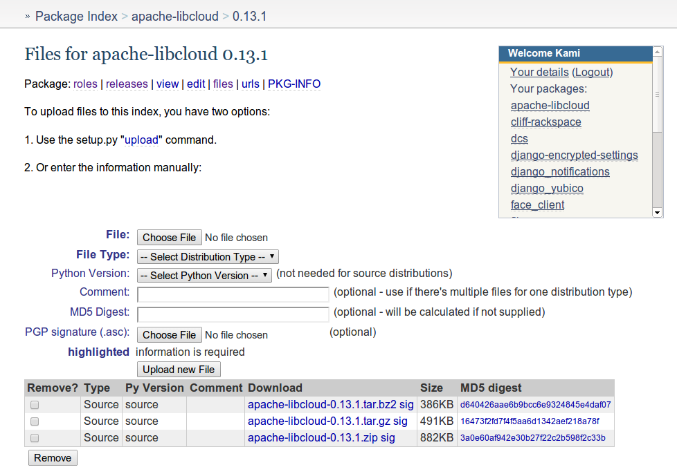

Committer Guide
===============

New committer guidelines
------------------------

.. note::

    This section outlines steps which need to be completed by new team members and
    is indented for people who have been voted to join Libcloud project as a
    committer and / or PMC member. It also assumes you have already filled
    your ICLA and your Apache account has been created.

First congratulations and welcome to the team!

1. Subscribe to the public mailing lists
~~~~~~~~~~~~~~~~~~~~~~~~~~~~~~~~~~~~~~~

If you haven't yet, subscribe to {dev,users,commits}@apache.libcloud.org
mailing lists. Committs mailing list is especially important because all of
the JIRA notification, Gihub Pull Request notifications and build notifications
are sent there.

2. Subscribe to the private mailing list
~~~~~~~~~~~~~~~~~~~~~~~~~~~~~~~~~~~~~~~~

Subscribe to private@libcloud.apache.org by sending an email to
private-subscribe@libcloud.apache.org. Keep in mind that this list is private
and your subscription needs to be approved by a moderator.

3. Create PyPi account
~~~~~~~~~~~~~~~~~~~~~~

Creating a PyPi account by going to
https://pypi.python.org/pypi?%3Aaction=register_form and send an email to
private@libcloud.apache.org requesting to be added as a maintainer to
`apache-libcloud <https://pypi.python.org/pypi/apache-libcloud/>`_ package.
Make sure to select a strong and unique password (``pwgen -s 48 1`` is your
friend).

After you have registered go to
"`Your details <https://pypi.python.org/pypi?%3Aaction=user_form>`_" page and
populate `PGP Key ID` field with your PGP key ID.

Applying a patch
----------------

When applying a third-party patch created using ``git format-patch`` command,
use the following command:

.. sourcecode:: bash

    git am --signoff < patch_name.patch

``--signoff`` argument signs the patch and lets others know that you have
reviewed and merged a patch.

After the patch has been applied, make sure to update ``CHANGES`` file.

Making a release (for release managers)
---------------------------------------

1. Pre-release check list

- Make sure tests pass on all the supported Python versions (``tox``)
- Make sure ``CHANGES`` file is up to date
- Make sure ``__version__`` string in ``libcloud/__init__.py`` is up to date

2. Creating release artifacts

We have a script that runs the required setup.py commands and then hashes
and signs the files. To run it:

.. sourcecode:: bash

    cd dist
    ./release.sh -u <yourusername>@apache.org

``-u`` argument will be used to find a key with a matching email address in
your local GPG database.

This should result in a set of
``apache-libcloud-${VERSION}.{tar.bz2,tar.gz,zip}{,asc,md5,sha1}`` files that
are suitable to be uploaded for a release.

3. Uploading release artifacts to Apache servers

* Add release artifacts to the dist SVN repository at
  https://dist.apache.org/repos/dist/release/libcloud/

  It may take up to a day for the artifacts to be available on all the
  Apache mirrors, but they should be instantly available at
  http://www.apache.org/dist/libcloud/.

* If there is more than one older release in the repository, delete the
  oldest one. Old releases are automatically archived and available at
  https://dist.apache.org/repos/dist/release/libcloud/.

4. Tagging a release

.. sourcecode:: bash

    git tag <tag> <commit hash>

For example:

.. sourcecode:: bash

    git tag v0.13.0 105b9610835f99704996d861d613c5a9a8b3f8b1

5. Publishing package to PyPi

For consistency and security reasons packages are always uploaded to PyPi
manually using the web interface and not using the ``setup.py upload`` command.

* Run ``python setup.py register upload`` command. This will register a new
  version on PyPi, but it won't upload the actual release artifacts.

* Go to the `PyPi release management page`_, find a new release and click on
  "files" link.

* Once you are there, upload all the release artifacts (.tar.bz2, .tar.gz and
  .zip). For ``File Type`` select ``Source`` and for ``Python Version`` select
  ``Any (ie. pure Python)``. Make sure to also select and upload a PGP
  signature for each file (``PGP signature (.asc)`` field).

Once all the files have been uploaded, the page should look similar to the
screenshot bellow.

7. Updating doap_libcloud.rdf file

Add information about the new release to the ``doap_libcloud.rdf`` file in the
root of the main code repository.

8. Updating website

* Update "News" page (``content/news.mdtext`` file)
* Update "Downloads" page (``content/downloads.mdtext`` file)
* Update "Get it" section in the sidebar (``templates/blocks/other.html`` file)

9. Sending announcements

* Send a release announcement to {dev,users}@libcloud.apache.org. If it's a
  major release also send it to announce@apache.org.
* Send a release announcement to Twitter and Google+

If needed, use Apache URL shortening service - http://s.apache.org/

.. _`PyPi release management page`: https://pypi.python.org/pypi?%3Aaction=pkg_edit&name=apache-libcloud
